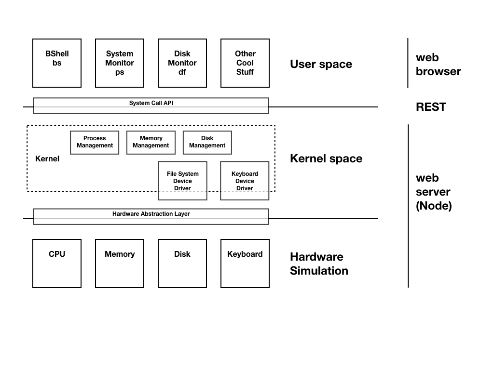

# mos-6502-6502
mos-6502 is a virtual 6502 processor written in TypeScript and running on Node.js.  This project is the practical component of Prof. Gormanly's Computer Organization and Architecture class.  This project strives to accomplish the following goals:
- A deep understanding of how the machine works. There is no better way to learn how computers actually work than to build one!
- You become a high level master of code by using OOP to create a virtual machine
- You become a low level ninja, creating programs in machine instructions to run on your creation! Enriching your understanding of the world below your compiler.
- Your design and debugging skills are pushed to solve problems that will melt your brain.  You will debug machine level code you write on a machine you built!

## What does mos-6502 mean?
The project needed a name, I like WebOS since this project is built on web technologies and the long term plan is to use this VM as the basis for a Operating Systems project.  In that project you will build an OS that can run on this VM.  Unfortunately, while the name WebOS makes sense for these reasons, I do not like talking to Lawyers so I have decided to use mos-6502 instead.  mos-6502 is something I bought the .dot com for a while ago and have not gotten around to using it for anything. If it makes no sense, keep trying, I left a clue.  The 'M' might stand for Microarchitecture, or maybe not.  I wonder if the lawyers will come anyway?  Regardless this is a good name until something better comes along.  Maybe SObeW instead?

## Credits
This software is an adaptation of a project created by [Dr. Alan Labouseur's](http://labouseur.com/courses/os/) for his Operating Systems (CMPT 424) course project.  That project builds a very cool operating system on top of a rudimentary virtual 6502 CPU.  This project focuses on building a robust and complete 6502 architecture and instruction set.  You will be creating a 6502 emulator programmed using TypeScript that will run on server side JavaScript in Node.js.  Here are references to Dr. Labouseur's original projects:
- 2019 version: https://github.com/AlanClasses/TSOS-2019
- 2015-2018 version: https://github.com/AlanClasses/TSOS

There are plans to possibly expand this project in a way that would allow you to continue to use it to build an adapted version of Dr. Labouseur's OS project on top of.  Here is an architecture diagram showing how this is planned currently.


## Getting Started

To setup a development environment for mos-6502, you will need the following installed and setup:
 - A terminal (If you are on windows I recommend gitbash which can be installed as part of your windows git client installation.
 - Node.js / npm
 - TypeScript (via npm)
 - A text editor / IDE (I recommend VS Code or Intellij if you are getting started with TypeScript)

If you already have Node.js and TypeScript installed you can skip ahead to the 'How to run' section below.

## Installation
### Node:
**Mac**
1. Recommend installation with homebrew: `brew install node`
2. You can use the following to download and run a pkg file:

`curl "https://nodejs.org/dist/latest/node-${VERSION:-$(wget -qO- https://nodejs.org/dist/latest/ | sed -nE 's|.*>node-(.*)\.pkg</a>.*|\1|p')}.pkg" > "$HOME/Downloads/node-latest.pkg" && sudo installer -store -pkg "$HOME/Downloads/node-latest.pkg" -target "/"`

**Windows:** There is a installer to download from Node.js website

Node getting started: https://nodejs.org/en/docs/guides/getting-started-guide/

I particularly like this resource as well: https://developer.mozilla.org/en-US/docs/Learn/Server-side/Express_Nodejs/development_environment

### TypeScript:
Documentation: https://www.typescriptlang.org/docs/home.html

Installing TypeScript: https://www.typescriptlang.org/docs/handbook/typescript-in-5-minutes.html
`npm install -g typescript`

## How to run
First run `npm install` to install node dependencies

Next, TypeScript must be compiled before you can run and after you make changes to TypeScript (.ts) files.  There is a provided bash script called 't.bash' in the project root.  You may need to add execute permission to the file before you can run.  

Once you run it, you should see that a dist/ folder is created in your project home and it contains the JavaScript that your Node.js server will run.

To start the node server run `npm start` that's it!

Once you have your project going, you should be able to recompile using the 't.bash' bash script and then 'npm start' to run node.

### @types/node
Type definitions to be used for Node.js. This should be installed when you run `npm install` to install dependencies. 
See : https://www.npmjs.com/package/@types/node
If they are not installed you can manually do so this way:
`npm install @types/node --save-dev`

## Other terminal commands
Terminal / powershell

to navigate to this directory in Terminal/ Powershell, use:
- ```cd C:\[your relative path]\mos-6502```

to navigate to this directory in gitbash, use:
-  ```cd "C:\[your relative path]\mos-6502"```

you must run the transpile file after any changes have been made to compile the .ts into .js. Use:
- cd into the correct directory 
- ```./"t.bash"```

Some bugs may be from a transpile error. To delete the Dist (Javascript folder) run:
- ```rm -rf dist/```